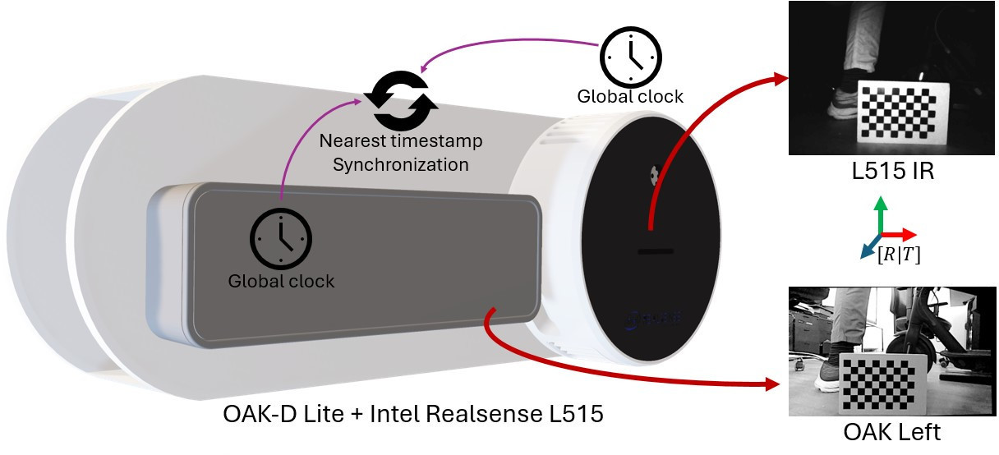
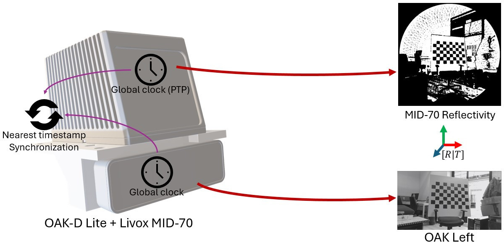
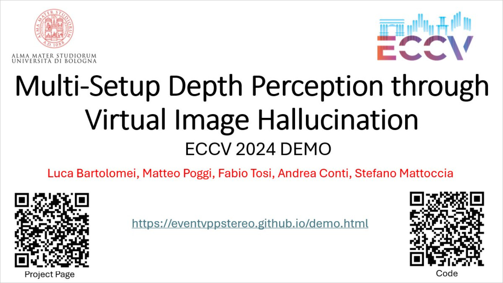

<h1 align="center"> Multi-setup depth perception through virtual image hallucination (ECCV 2024 DEMO) </h1> 

<h2 align="center"> 

 [Project Page](https://eventvppstereo.github.io/demo.html)
</h2>

<br>

:rotating_light: This repository contains download links to our code of our prototype  "**Multi-setup depth perception through virtual image hallucination**",  [ECCV 2024 DEMOs](https://eccv.ecva.net/). Our prototype is based on our previous works "**Active Stereo Without Pattern Projector**",  [ICCV 2023](https://iccv2023.thecvf.com/) and "**Stereo-Depth Fusion through Virtual Pattern Projection**", Journal Extension of ICCV paper, **Revisiting Depth Completion from a Stereo Matching Perspective for Cross-domain Generalization** [3DV 2024](https://3dvconf.github.io/2024/), **LiDAR-Event Stereo Fusion with Hallucinations** [ECCV 2024](https://eccv.ecva.net/). You can find all links here: [Related Papers](https://lnk.bio/eccv24demo)

by [Luca Bartolomei](https://bartn8.github.io/)<sup>1,2</sup>, [Matteo Poggi](https://mattpoggi.github.io/)<sup>1,2</sup>, [Fabio Tosi](https://fabiotosi92.github.io/)<sup>2</sup>, [Andrea Conti](https://andreaconti.github.io/)<sup>2</sup>, and [Stefano Mattoccia](https://github.com/stefano-mattoccia)<sup>1,2</sup>

Advanced Research Center on Electronic System (ARCES)<sup>1</sup>
University of Bologna<sup>2</sup>

<div class="alert alert-info">

<h2 align="center"> 

 Active Stereo Without Pattern Projector (ICCV 2023)<br>

 [Project Page](https://vppstereo.github.io/) | [Paper](https://vppstereo.github.io/assets/paper.pdf) |  [Supplementary](https://vppstereo.github.io/assets/paper-supp.pdf) | [Poster](https://vppstereo.github.io/assets/poster.pdf) | [Code](https://github.com/bartn8/vppstereo)
</h2>

<h2 align="center"> 

 Stereo-Depth Fusion through Virtual Pattern Projection (Journal Extension)<br>

 [Project Page](https://vppstereo.github.io/extension.html) | [Paper](https://arxiv.org/pdf/2406.04345) | [Code](https://github.com/bartn8/vppstereo)
</h2>

<h2 align="center"> 

 Revisiting Depth Completion from a Stereo Matching Perspective for Cross-domain Generalization (3DV 2024)<br>

 [Project Page](https://vppdc.github.io/) | [Paper](https://vppdc.github.io/assets/paper.pdf) | [Supplementary](https://vppdc.github.io/assets/paper-supp.pdf) | [Code](https://github.com/bartn8/vppdc/)
</h2>

<h2 align="center"> 

 LiDAR-Event Stereo Fusion with Hallucinations (ECCV 2024)<br>

 [Project Page](https://eventvppstereo.github.io/) | [Paper](https://arxiv.org/pdf/2408.04633) | [Code](https://github.com/bartn8/eventvppstereo/)
</h2>

**Note**: 🚧 Kindly note that this repository is currently in the development phase. We are actively working to add and refine features and documentation. We apologize for any inconvenience caused by incomplete or missing elements and appreciate your patience as we work towards completion.

## :bookmark_tabs: Table of Contents

- [:bookmark\_tabs: Table of Contents](#bookmark_tabs-table-of-contents)
- [:clapper: Introduction](#clapper-introduction)
- [:movie\_camera: Watch Our Research Video!](#movie_camera-watch-our-research-video)
- [:memo: Code](#memo-code)
  - [:hammer\_and\_wrench: Setup Instructions](#hammer_and_wrench-setup-instructions)
- [:envelope: Contacts](#envelope-contacts)
- [:pray: Acknowledgements](#pray-acknowledgements)

</div>

## :clapper: Introduction

The demo aims to showcase a novel matching paradigm, proposed at [ICCV 2023](https://openaccess.thecvf.com/content/ICCV2023/papers/Bartolomei_Active_Stereo_Without_Pattern_Projector_ICCV_2023_paper.pdf), based on projecting virtual patterns onto conventional stereo pairs according to the sparse depth points gathered by a depth sensor to achieve robust and dense depth estimation at the resolution of the input images.
We will showcase to the ECCV community how flexible and effective the virtual pattern projection paradigm is through a real-time demo based on off-the-shelf cameras and depth sensors. 




:fountain_pen: If you find this code useful in your research, please cite:

```bibtex
@InProceedings{Bartolomei_2023_ICCV,
    author    = {Bartolomei, Luca and Poggi, Matteo and Tosi, Fabio and Conti, Andrea and Mattoccia, Stefano},
    title     = {Active Stereo Without Pattern Projector},
    booktitle = {Proceedings of the IEEE/CVF International Conference on Computer Vision (ICCV)},
    month     = {October},
    year      = {2023},
    pages     = {18470-18482}
}
```

```bibtex
@misc{bartolomei2024stereodepth,
      title={Stereo-Depth Fusion through Virtual Pattern Projection}, 
      author={Luca Bartolomei and Matteo Poggi and Fabio Tosi and Andrea Conti and Stefano Mattoccia},
      year={2024},
      eprint={2406.04345},
      archivePrefix={arXiv},
      primaryClass={cs.CV}
}
```

```bibtex
@inproceedings{bartolomei2024revisiting,
  title={Revisiting depth completion from a stereo matching perspective for cross-domain generalization},
  author={Bartolomei, Luca and Poggi, Matteo and Conti, Andrea and Tosi, Fabio and Mattoccia, Stefano},
  booktitle={2024 International Conference on 3D Vision (3DV)},
  pages={1360--1370},
  year={2024},
  organization={IEEE}
}
```

```bibtex
@inproceedings{bartolomei2024lidar,
  title={LiDAR-Event Stereo Fusion with Hallucinations},
  author={Bartolomei, Luca and Poggi, Matteo and Conti, Andrea and Mattoccia, Stefano},
  booktitle={European Conference on Computer Vision (ECCV)},
  year={2024},
}
```

## :movie_camera: Watch Our Research Video!

<a href="https://eventvppstereo.github.io/demo.html#myvideo">
  
</a>


## :memo: Code

You can build our prototype from scratch using our code and your L515 and OAK-D Lite sensors. We tested our code using both Jetson Nano (arm64) and a standard amd64 ubuntu PC.


### :hammer_and_wrench: Setup Instructions

1. **Dependencies**: Ensure that you have installed all the necessary dependencies. The list of dependencies can be found in the `./vpp/requirements.txt` and `./vppdc/requirements.txt` files. The Livox MID70 requires a [PTP Master](https://github.com/ptpd/ptpd) running on the same network.
2. **Build the Python Livox Lib**: The demos that use Livox LiDAR needs our python porting that can be installed using our script `./mypylivox/compile.sh`. Please install the [LivoxSDK](https://github.com/Livox-SDK/Livox-SDK) replacing `CMakeLists.txt` with our custom `./mypylivox/CMakeLists.txt`.

3. **Calibration (1)**: Ensure that LiDAR and OAK-D Lite are rigidly attached to each other (you can 3D print our supports using the step files). Given a [chessboard calibration object](https://github.com/opencv/opencv/blob/4.x/doc/pattern.png), please record a sequence of frame where the chessboard is visible on both OAK-D left camera and L515 IR camera / MID70 Reflectivity pseudo-image using our scripts:

```bash
python calibration_recorder_l515.py --outdir <chessboard_folder>
python calibration_recorder_mid70.py --outdir <chessboard_folder>
```

4. **Calibration (2)**: Estimate the rigid transformation between L515 IR camera and OAK-D left camera using the previous recorder frames and our script (edit arguments ```square_size``` and ```grid_size``` to match your chessboard object):

```bash
python calibration_l515.py --dataset_dir <chessboard_folder> --square_size 17 --grid_size 9 6
python calibration_mid70.py --dataset_dir <chessboard_folder> --square_size 92 --grid_size 9 6 --binary_threshold 7 --median_kernel_size 3
```

5. **Launch the demo**: Run our ```demo_*.py``` scripts to see our virtual pattern projection (VPP) and VPP for Depth Completion in real-time.


## :envelope: Contacts

For questions, please send an email to luca.bartolomei5@unibo.it

## :pray: Acknowledgements

We would like to extend our sincere appreciation to Nicole Ferrari who developed the time synchronization algorithm and to [PyRealSense](https://github.com/IntelRealSense/librealsense/blob/master/wrappers/python/readme.md), [DepthAI](https://github.com/luxonis/depthai) and [LivoxSDK](https://github.com/Livox-SDK/Livox-SDK) developers.


<h5 align="center">Patent pending - University of Bologna</h5>
